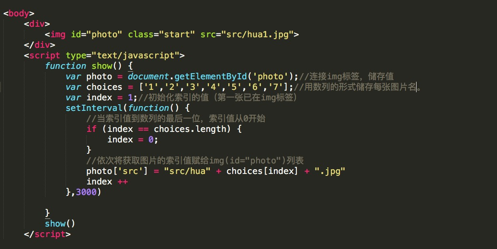
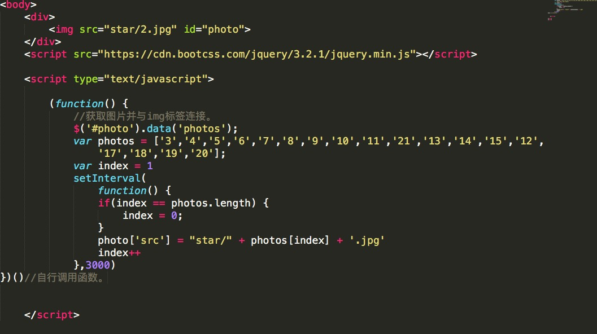
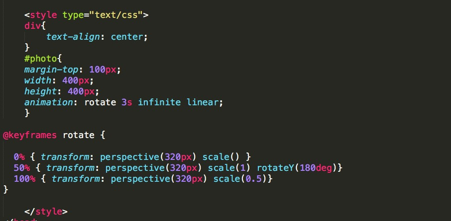

# js-carousel-and-jq-carousel
<h3 style="color:violet">分别用javaScript和 Jquery实现图片自动轮播</h3>
只是一个新手写下自己实现图片自动轮播的代码方便自己回顾。
###效果图：
<iframe height=498 width=510 src="./markdownjietu/dongtaitu.mp4" frameborder=0 allowfullscreen></iframe>
###js方法代码如下：

###jq方法代码如下：

###加点样式css代码如下：

[源代码链接]：
https://github.com/Yourmajesty999/js-carousel-and-jq-carousel
